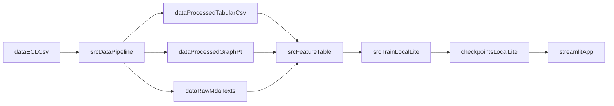

# Presentation Notes (10 min, 2 speakers)

Project: **Financial Distress & Bankruptcy Risk Prediction**  
Repo root: `financial_distress/`  
Audience: mixed (some ML knowledge)  

## Quick facts (pull from the repo)

- **Task**: predict \(P(\text{distress}=1)\) for firm–period observations (ECL label). See `checkpoints/local_lite/meta.json` (`label_positive_meaning`).
- **Dataset scale (accepted baseline)**: `config.yaml`
  - Filtered rows: **75,518**
  - Unique companies: **7,926**
  - Bankruptcy/distress rate: **0.0079**
  - Year range: **1993–2021**
- **Local Lite model (the app default)**: `checkpoints/local_lite/model.joblib`
  - Best model family: **HistGradientBoosting** (meta: `best_model_name = hist_gbdt`)
  - Calibration: **sigmoid 3-fold** (`probability_calibration = sigmoid_3fold`)
  - Recommended threshold: **0.0344** (`recommended_threshold`)
  - Uses **text stats** + **graph degree** toggles: `use_text_stats=true`, `use_graph_degree=true`
- **Holdout metrics (local_lite)**: `checkpoints/local_lite/metrics_eval.json`
  - ROC-AUC: **0.8273**
  - PR-AUC: **0.04278**
  - F1: **0.1026**
  - Precision: **0.0741**
  - Recall: **0.1667**
  - Threshold: **0.03443**

## Speaker split

- **Presenter A**: Slides 1–4 (problem → data → architecture → local model training)  
- **Presenter B**: Slides 5–8 (metrics → multimodal + Lightning GPU → app demo → deploy/repro)  

Use the handoff lines verbatim to keep the flow clean.

---

## Slide 1 — Problem & objective (Presenter A)

### Slide content (bullets)
- **Problem**: early identification of **financial distress / bankruptcy-related risk**.
- **Output**: calibrated probability \(P(\text{distress})\) + risk band (screening tool).
- **Why hard**: distress is **rare** (~0.79% positives), and data is time-dependent.

### Speaker notes (A)
- “We’re predicting a bankruptcy-related distress label from an ECL-style dataset. The key deliverable is a probability score we can rank and threshold.”
- “Because positives are rare, accuracy is misleading; we focus on PR-AUC, recall/precision trade-offs, and calibration.”

### Handoff line (A → B later)
- “Next, I’ll show the data artifacts and how we turn them into model-ready features.”

---

## Slide 2 — Dataset & artifacts (Presenter A)

### Slide content (bullets)
- **Raw**: `data/ECL (1).csv` (Git LFS)
- **Processed**: `data/processed/tabular.csv` (model/app input)
- **Optional**:
  - MD&A texts: `data/raw/mda_texts/` (not committed; huge)
  - Graph: `data/processed/graph.pt` (SIC/industry proxy)

### Speaker notes (A)
- “The project is designed so the app can run off the processed artifacts. The raw ECL file is mainly for regenerating the pipeline.”
- “Text is handled two ways: cheap stats for the app, and heavier embeddings for the multimodal model.”

### If asked “what is MD&A?”
- “Management’s Discussion & Analysis (Item 7 of 10‑K). We extract it and either compute simple length signals or embed it with FinBERT.”

---

## Slide 3 — System architecture flow (Presenter A)

### Slide content (bullets)
1. `data/ECL (1).csv` → pipeline → `data/processed/tabular.csv` (+ optional `graph.pt`, `mda_texts/`)
2. `src/feature_table.py` builds **X features** + **y labels**
3. Train `src/train.py --mode local_lite` → `checkpoints/local_lite/*`
4. Streamlit loads model + artifacts → interactive scoring + insights

### Speaker notes (A)
- “The design choice that makes deployment work: `src/feature_table.py` is separated from the PyTorch dataset so Streamlit doesn’t import the full multimodal stack at startup.”
  - Cite: `src/feature_table.py` docstring.
- “In the app, scoring is cached and keyed by the model/data paths.”

### Mermaid snippet (optional for slides)

---

## Slide 4 — Local Lite model training (Presenter A)

### Slide content (bullets)
- Entry: `python3 -m src.train --mode local_lite`
- Candidate models (selection by validation PR-AUC):
  - `hist_gbdt`, `random_forest`, `extra_trees`, `log_reg` (+ optional weighted ensemble)
- **Calibration**: `CalibratedClassifierCV` (sigmoid, 3-fold)
- Output artifacts: `checkpoints/local_lite/model.joblib`, `meta.json`, metrics JSONs

### Speaker notes (A)
- “We run time-aware splitting via `time_split` (see `src/dataset.py` + its usage in `src/train.py` and `src/evaluate.py`).”
- “Why calibration matters: we want probabilities that are interpretable, not raw scores.”
- “Threshold is tuned (recommended in `meta.json`) to balance precision/recall for rare positives.”

### Handoff line (A → Presenter B)
- “Now that you’ve seen how we train the baseline, B will walk through what the metrics mean and how the GPU multimodal model fits in.”

---

## Slide 5 — Metrics (imbalanced label) (Presenter B)

### Slide content (bullets)
- **ROC-AUC**: ranking ability overall
- **PR-AUC**: key for rare positive class
- Thresholded metrics at **0.0344**:
  - Precision **0.0741**, Recall **0.1667**, F1 **0.1026**

### Speaker notes (B)
- “The positive rate is under 1%, so PR-AUC is the more honest metric. ROC-AUC can look strong even when precision is low.”
- “We explicitly report precision/recall/F1 at a chosen operating point (threshold) so the audience can interpret alerts vs false positives.”
- “All numbers are from `checkpoints/local_lite/metrics_eval.json`.”

---

## Slide 6 — Multimodal model + Lightning AI GPU (Presenter B)

### Slide content (bullets)
- Multimodal goal: exploit **tabular + MD&A text + graph proxy**
- Architecture: **three encoders → attention/gated fusion → classifier**
- Trained on **Lightning AI GPU** for speed (SSH + run scripts)
- Command path: `docs/LIGHTNING_GPU_TRAINING.md` or `scripts/lightning_train_multimodal.sh`

### Speaker notes (B)
- “Text is encoded via chunk embeddings (FinBERT). Graph is a context proxy (e.g., degree).”
- “We recommend GPU training for embeddings + multimodal training due to runtime.”
- “The doc includes practical flags: class-balanced batches, focal loss, early stopping, modality dropout.”

### Diagram content (talk track)
- Tabular branch: `src/models/tabular_branch.py`
- Text branch: `src/models/text_branch.py` (input shape typically `(batch, chunks, 768)`)
- Graph proxy: `src/models/graph_branch.py`
- Fusion: `src/models/fusion.py`
- Train entry: `src/train_multimodal.py`

---

## Slide 7 — Streamlit app demo (Presenter B)

### Slide content (bullets)
- App path: `app/streamlit_app.py`
- Tabs: Portfolio, Upload, Contextual, EDA, Training Insights
- Optional: OpenRouter narrative summaries (secrets/env only)

### 90-second demo script (B)
1. **Portfolio Scoring**: show ranked risk table; mention cached scoring.
2. **Upload Your Records**: upload `sample_upload_records.csv`; show predicted risk + explanation.
3. **EDA**: label distribution + missingness panel (quick credibility check).
4. **Training Insights**: show metric snapshot (local_lite) and explain PR-AUC vs ROC-AUC.

### OpenRouter note (say out loud)
- “LLM summaries are optional and do not change predictions—only provide readable narratives. Keys are supplied via `.env` or Streamlit secrets; never typed into the UI.”

---

## Slide 8 — Deployment & reproducibility (Presenter B)

### Slide content (bullets)
- Streamlit Cloud: `docs/STREAMLIT_CLOUD.md`
  - Main file: `app/streamlit_app.py`
  - Requirements: `requirements-app.txt`
  - Python: `runtime.txt` (3.11)
- Large files via **Git LFS**: ECL CSV, model, processed tabular, graph
- Preflight: `python3 scripts/check_streamlit_cloud_ready.py`

### Speaker notes (B)
- “The deploy doc is explicit: main file path, requirements, secrets, and what artifacts must be present.”
- “Git LFS is important: if LFS objects aren’t pulled, files look like tiny pointer text and the app can’t load the model/data.”

### Close
- “Main takeaway: we delivered a calibrated baseline that’s deployable, plus an optional multimodal GPU path for experimentation.”

---

## Appendix — What to say if asked (quick answers)

### “Why split `feature_table` from the Dataset?”
- “Streamlit startup should be lightweight. `src/feature_table.py` avoids importing PyTorch `Dataset` and multimodal training code, but still produces the same model-ready features.”

### “What features does local_lite use?”
- From `checkpoints/local_lite/meta.json` (`features` list):
  - Core accounting/ratios + text stats (`mda_*`) + `graph_degree`.

### “What’s the evaluation split?”
- “Time-aware splitting is used via `time_split` (see `src/train.py` and `src/evaluate.py` calling `time_split(base_df, test_ratio=0.2)`).”

### “What’s the model used for the app?”
- “The app loads `checkpoints/local_lite/model.joblib` and calls `predict_proba` on the feature table.”

---

## Appendix — Limitations (say this proactively if asked)

- **Imbalanced label**: positives are rare (~0.79%), so PR-AUC and precision/recall at threshold matter more than accuracy.
- **Correlation vs causation**: model captures statistical risk signals; it is not a causal claim about bankruptcy.
- **Dataset shift**: relationships can drift over time; time-based evaluation helps, but periodic retraining is still needed.
- **Text/graph optionality**: if MD&A files or graph artifacts are missing, the system falls back to tabular-only behavior (or substitutes zeros), which can change performance.
- **LLM narratives**: OpenRouter summaries are optional and non-deterministic; they do not change predictions.

---

## Appendix — Troubleshooting (“if something breaks”)

### 1) Streamlit says “Model not found” / “Tabular CSV not found”
- Confirm these paths exist relative to the repo root:
  - `checkpoints/local_lite/model.joblib`
  - `data/processed/tabular.csv`
- If you cloned fresh, run **Git LFS pull**:
  - `git lfs install` (once per machine)
  - `git lfs pull`

### 2) Files look tiny and start with `version https://git-lfs.github.com/spec/v1`
- That means you have **LFS pointer files**, not the real content.
- Fix: `git lfs pull`

### 3) OpenRouter panels show “missing key” / summaries fail
- Streamlit Cloud: set secrets `OPENROUTER_API_KEY` and (optional) `OPENROUTER_MODEL` (see `docs/STREAMLIT_CLOUD.md`).
- Local: create `.env` from `.env.example` and set `OPENROUTER_API_KEY`. Do not commit `.env`.

### 4) Streamlit Cloud OOM / slow startup
- Use `requirements-app.txt` (already configured in `docs/STREAMLIT_CLOUD.md`).
- In the app sidebar, turn off **Use graph degree** if needed (it requires loading `graph.pt`).

### 5) Lightning GPU training flags “unrecognized arguments”
- Your Lightning Studio likely has an old copy of `src/`.
- Follow `docs/LIGHTNING_GPU_TRAINING.md` section “Sync latest Python trainers” (copy updated `src/train.py`, `src/train_multimodal.py`, and `src/metrics_classification.py`).

